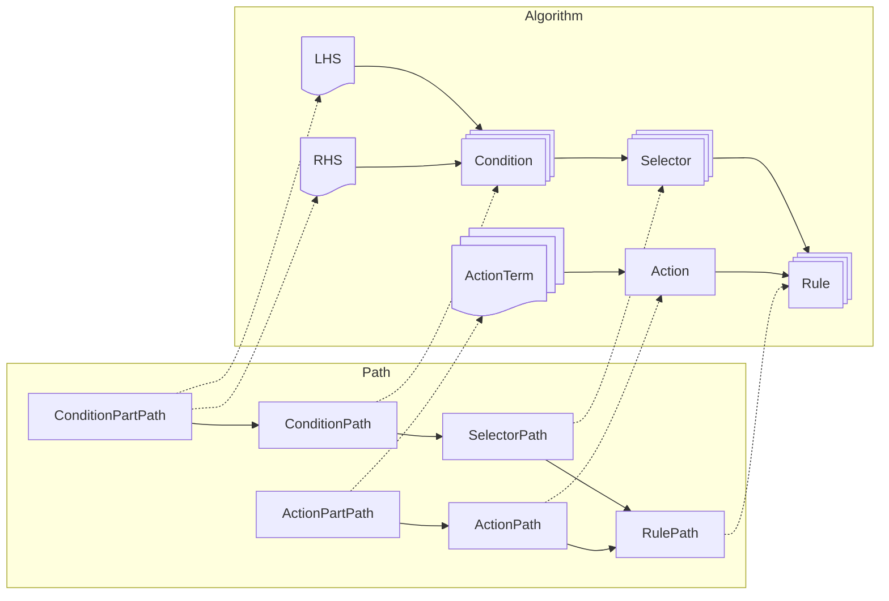

```mermaid
flowchart LR

subgraph Path
  RulePath
  SelectorPath --> RulePath
  ActionPath  --> RulePath
  ActionPartPath --> ActionPath
  ConditionPath --> SelectorPath
  ConditionPartPath --> ConditionPath
end

subgraph Algorithm
  Rule@{shape: procs}
  Selector@{shape: procs} --> Rule
  Action --> Rule
  ActionTerm@{shape: docs} --> Action
  Condition@{shape: procs} --> Selector
  LHS@{shape: doc} --> Condition
  RHS@{shape: doc} --> Condition
end


RulePath -.-> Rule
SelectorPath -.-> Selector
ActionPath -.-> Action
ActionPartPath -.-> ActionTerm
ConditionPath -.-> Condition
ConditionPartPath -.-> LHS & RHS

```
